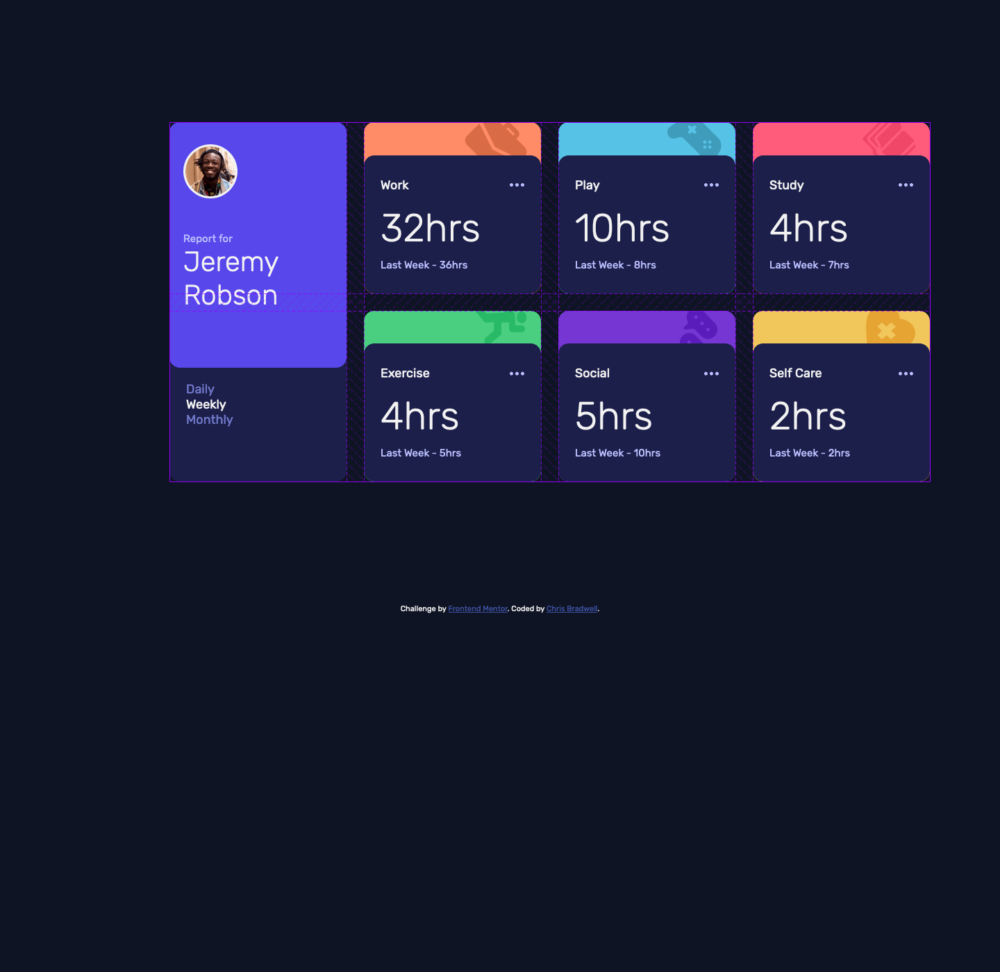

# Frontend Mentor - Time tracking dashboard

This is my solutions to the following challenge from Fronend Mentor.

## Table of contents

- [Overview](#overview)
  - [Challenge](#challenge)
  - [Screenshots](#screenshot)
  - [Github Link](#github)
- [My Process](#process)
  - [Built with](#built-with)
  - [What i learnt](#what-i-learnt)
  - [Continued Development](#development)
  - [resources](#resources)
- [Author](#author)

## Overview

### The challenge

Your challenge is to build out this dashboard and get it looking as close to the design as possible.

You can use any tools you like to help you complete the challenge. So if you've got something you'd like to practice, feel free to give it a go.

If you would like to practice working with JSON data, we provide a local `data.json` file for the activities. This means you'll be able to pull the data from there instead of using the content in the `.html` file.

Your users should be able to:

- View the optimal layout for the site depending on their device's screen size
- See hover states for all interactive elements on the page
- Switch between viewing Daily, Weekly, and Monthly stats

Want some support on the challenge? [Join our Slack community](https://www.frontendmentor.io/slack) and ask questions in the **#help** channel.

### Screenshots

### Github

- [GitHub Pages](https://bradwellc.github.io/FEM_Time-tracking-dasboard/)

## My Process

I started with building the mobile version then worked on the desktop version - when i started the card body was layed out one way but when setting up the desktop version I realised that it wouldnt work that way so had to change everything and start over.

All cards have been set up in a grid with the content being displayed as a flexbox.

Mobile version: 375px
Desktop version: 1440px

### Built With

- Semantic HTML5 markup
- CSS custom properties
- Mobile-first workflow
- Flex
- Grid

### What i Learnt

Used this challenge as a way of testing my skills and just building up a portfolio for projects created. I also used this project to get more work with grid and how it works.

### Continued Development

I will continue doing this challenges but look at doing the more conplex ones and see how i find them or if they are too much for me.

## Author

- Chris Bradwell
- Frontend Mentor - [@BradwellC](https://www.frontendmentor.io/profile/BradwellC)
